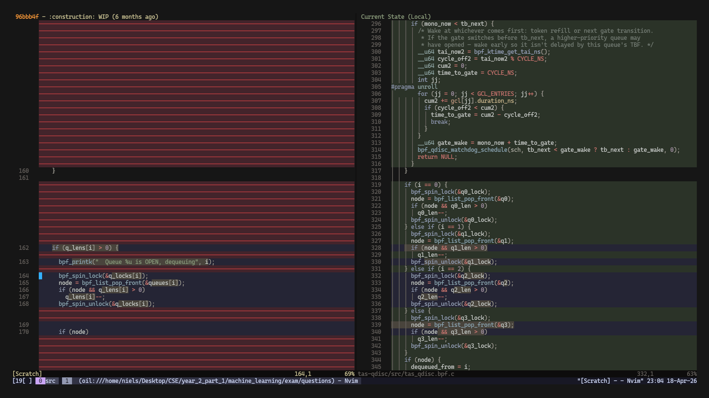

# saywhatnow.nvim

A Neovim "Time Machine" for your code. Scrub through the git history of any function or selection in a live side-by-side diff — without leaving your editor.

## Features

- Scrub through every commit that touched a function or code region
- Side-by-side diff: current code on the left, historical version on the right
- TreeSitter-powered function boundary detection in normal mode
- Works with visual selections for arbitrary line ranges
- Commit hash, message, and date shown in the window bar



## Requirements

- Neovim 0.9+
- [nvim-treesitter](https://github.com/nvim-treesitter/nvim-treesitter) with parsers for your languages
- Git
- [gh](https://cli.github.com/) (optional — required for `gp` to open PRs in the browser)

## Installation

### lazy.nvim

```lua
{
  "nsavvide/saywhatnow.nvim",
  dependencies = { "nvim-treesitter/nvim-treesitter" },
  config = function()
    require("saywhatnow").setup()
  end,
}
```

### packer.nvim

```lua
use {
  "nsavvide/saywhatnow.nvim",
  requires = { "nvim-treesitter/nvim-treesitter" },
  config = function()
    require("saywhatnow").setup()
  end,
}
```

## Setup

```lua
require("saywhatnow").setup()
```

No configuration options yet — everything works out of the box.

## Usage

### Normal mode

Place your cursor anywhere inside a function, then call:

```lua
require("saywhatnow").start_normal()
```

The plugin uses TreeSitter to detect the function boundaries automatically.

### Visual mode

Select any line range in visual mode, then call:

```lua
require("saywhatnow").start_visual()
```

### Suggested keymaps

```lua
vim.keymap.set("n", "<leader>gt", require("saywhatnow").start_normal, { desc = "Git time machine (function)" })
vim.keymap.set("v", "<leader>gt", require("saywhatnow").start_visual, { desc = "Git time machine (selection)" })
```

## Keybindings

These bindings are active while the time machine window is open:

| Key     | Action                            |
|---------|-----------------------------------|
| `H`     | Go back in time (older commit)    |
| `L`     | Go forward in time (newer commit) |
| `gp`    | Open associated PR in browser     |
| `q`     | Close the time machine            |
| `?`     | Show help                         |
| `<Esc>` | Close help popup                  |

## How it works

1. Resolves the line range from the cursor position (via TreeSitter) or visual selection
2. Runs `git log -L start,end:filepath` to find every commit that touched those lines
3. Opens a vertical split in diff mode
4. Fetches the file at each commit with `git show commit:filepath` and renders it on the right
5. `H` / `L` step through the commit list, updating the diff in real time

## License

MIT
